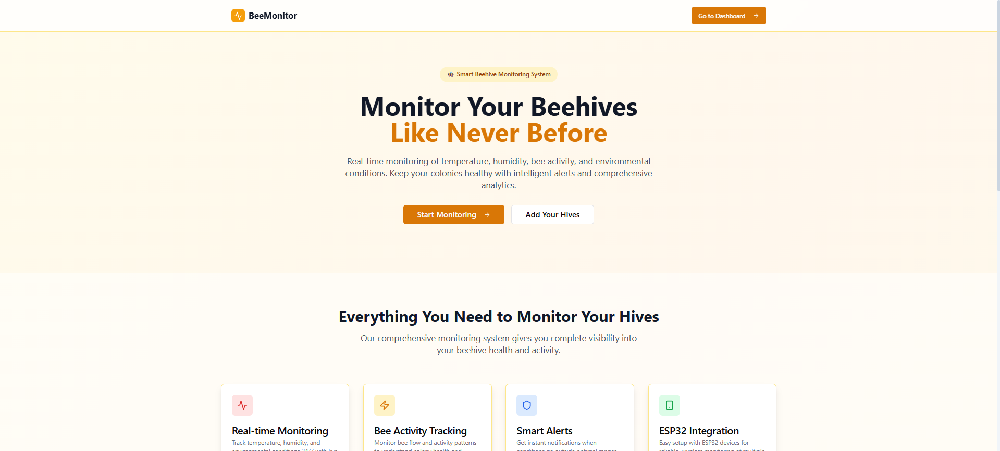
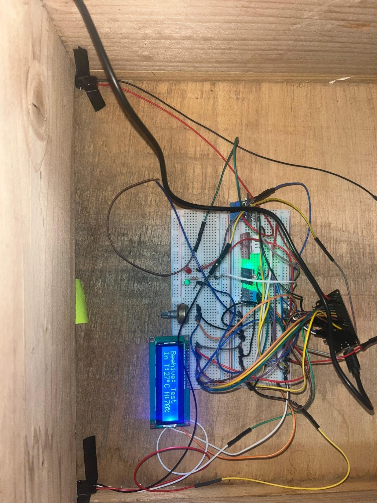

# Smart Beehive Monitoring System (ESP32)

An IoT-based beehive monitoring system built with **ESP32** that measures environmental conditions and bee activity, displays data locally on an LCD, and sends real-time data to a remote server via HTTP API.

---
## 📸 Project Images

### 🖥️ Web Dashboard


### 🔌 Hardware Wiring


### 🐝 Beehive Setup



## 🚀 Features

- 📡 Wi-Fi connectivity (ESP32)
- 🌡️ Temperature & humidity monitoring
  - Inside hive: **DHT11**
  - Outside hive: **DHT22**
- 🌞 Automatic day/night detection using **LDR**
- 🐝 Bee flow counting using **IR break-beam sensor**
- 🔌 Relay-controlled IR sensor power (active only when needed)
- 📟 16x2 LCD display with automatic inside/outside data toggle
- ☁️ HTTP POST data transmission to cloud API
- 🔴🟢 Status LEDs indicating bee flow activity

---

## 🧠 System Logic Overview

- The **LDR sensor** detects light level to determine day/night:
  - Day → IR sensor enabled
  - Night → IR sensor disabled (power cut via relay)
- Each bee passing through the IR sensor triggers an interrupt.
- Bee count is aggregated and sent periodically to the server.
- Environmental data is sent continuously when valid.
- LEDs turn on for 15 seconds after each bee flow update:
  - 🟢 Green: normal activity
  - 🔴 Red: low activity

---

## 🧩 Hardware Components

| Component | Description |
|---------|------------|
| ESP32 | Main microcontroller |
| DHT11 | Inside temperature & humidity |
| DHT22 | Outside temperature & humidity |
| LDR | Light intensity detection |
| IR Break Beam Sensor | Bee counting |
| Relay Module | IR sensor power control |
| 16x2 LCD | Local data display |
| LEDs | Bee flow status indication |

---

## 🔌 Pin Configuration

### LCD (16x2)
| LCD Pin | ESP32 GPIO |
|------|-----------|
| RS | 14 |
| E  | 27 |
| D4 | 26 |
| D5 | 25 |
| D6 | 33 |
| D7 | 32 |

### Sensors & Actuators
| Device | GPIO |
|------|------|
| DHT11 (Inside) | 21 |
| DHT22 (Outside) | 19 |
| LDR | 34 (Analog) |
| IR Sensor | 18 |
| Relay | 5 |
| Red LED | 4 |
| Green LED | 2 |

---

## 🌐 Cloud Communication

- **Base API URL:**  
  `https://beemonitor.vercel.app/api`

### Endpoints Used
- `/sensor-data` → environmental data
- `/bee-flow` → bee activity count

### Data Sent (JSON)
```json
{
  "beehive_id": 21,
  "device_id": "dre",
  "inside_temp": 25.3,
  "inside_humidity": 60,
  "outside_temp": 22.8,
  "outside_humidity": 55,
  "light_level": 3200,
  "system_active": true
}
